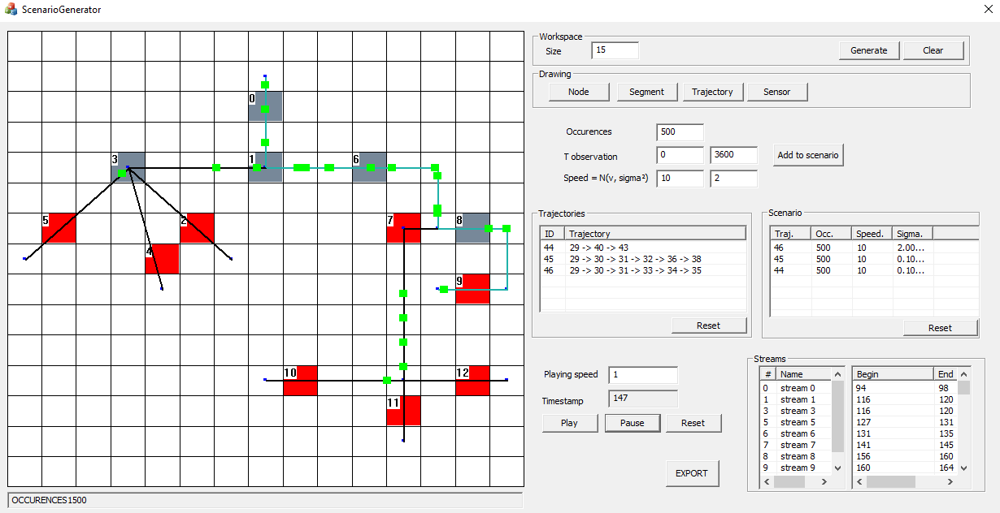

# Quantitative Interval Stream Mining

## Abstract

## Algorithms 

### Pairwise stream dependenices mining

#### ITLD (Interval Time Lag Discovery)

#### TEDDY  
Marc Plantevit, Céline Robardet, Vasile-Marian Scuturici: 
**Graph dependency construction based on interval-event dependencies detection in data streams**. Intell. Data Anal. 20(2): 223-256 (2016)

#### PIVOTMiner  
Marwan Hassani, Yifeng Lu, Jens Wischnewsky, Thomas Seidl: 
**A geometric approach for mining sequential patterns in interval-based data streams**. FUZZ-IEEE 2016: 2128-2135

### Complex Temporal Dependencies Mining

#### CTDMiner (Complex Temporal Dependency Miner)

## Data sets
### Real world datasets
#### Fox

### Synthetic Data
#### Simulation Tool 
  
#### Synthetic - Delta

#### Synthetic - Density

#### Synthetic - Temporal Variability

